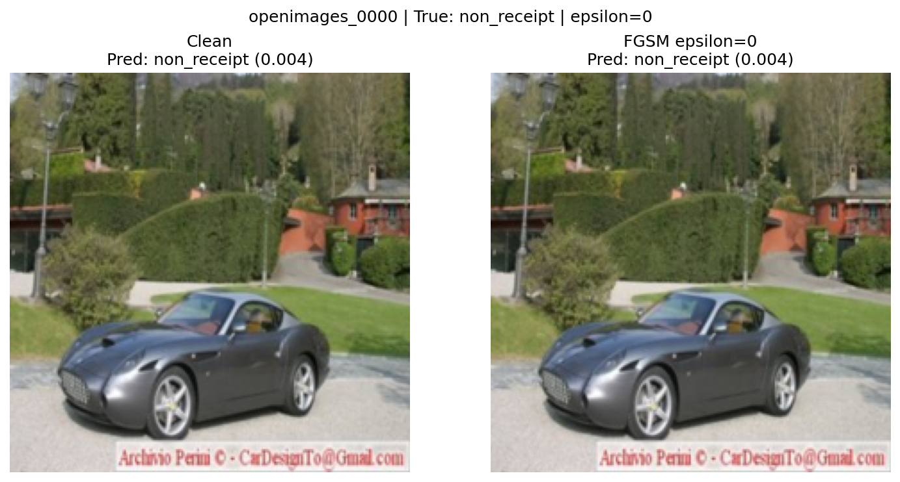
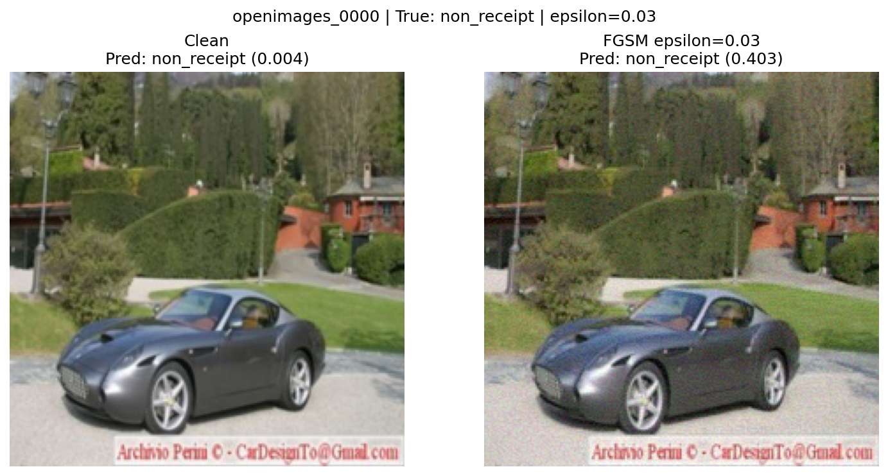
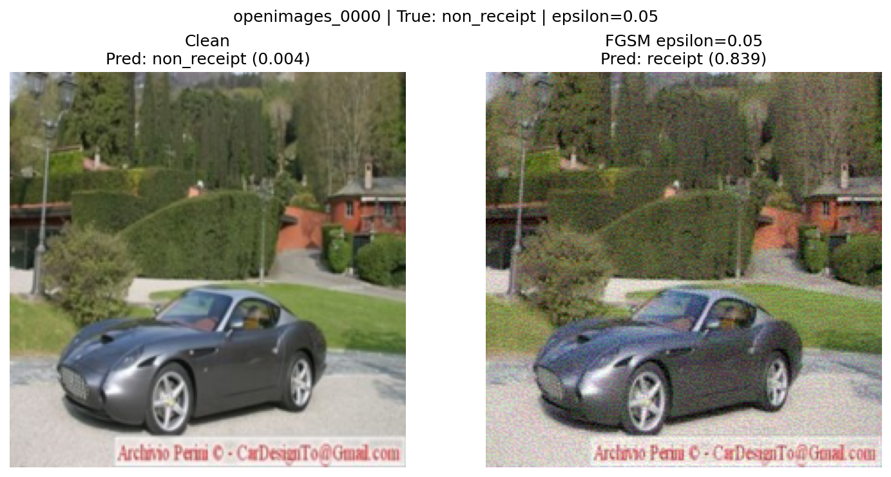
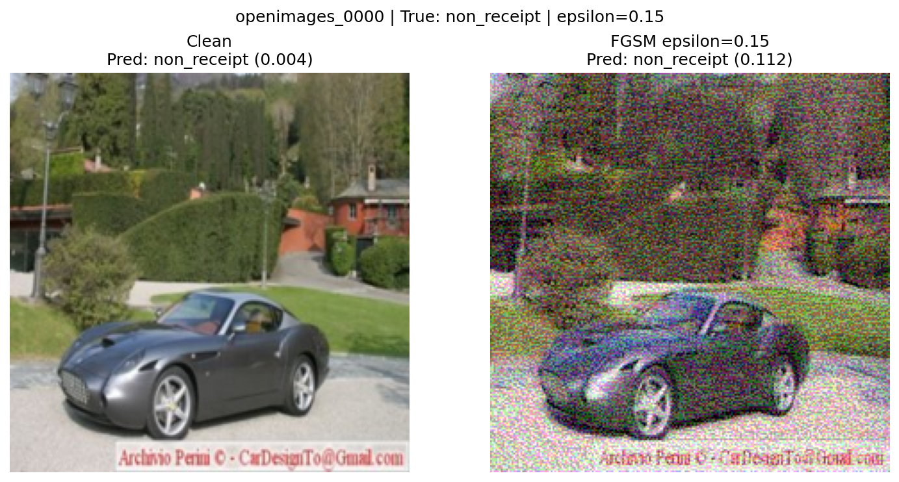

# FGSM Evasion Attack Results

## Clean Model Baseline

Baseline from `evaluate.py` on the untouched `balanced_data/test` set (390 images,
195 receipt / 195 non_receipt):

- **Model:** ReceiptCNN (`checkpoints/receipt_cnn_clean.pt`)
- **Test accuracy:** 0.9436
- **Precision:** 0.9943 | **Recall:** 0.8923 | **F1:** 0.9405
- **FGSM baseline:** At ε = 0.000 the adversarial image is pixel-identical to the
  clean image and adversarial accuracy equals the clean accuracy (0.9436) with an
  attack success rate of 0.0000. This confirms all degradation below comes from the
  perturbation, not from the evaluation loop.

## FGSM Results

Sweep across six ε values (per-image white-box FGSM, batch size 1, 390 test images):

| Epsilon | Clean Accuracy | Adversarial Accuracy | Attack Success Rate |
|---------|---------------|---------------------|-------------------|
| 0.000 | 0.9436 | 0.9436 | 0.0000 |
| 0.010 | 0.9436 | 0.8077 | 0.1440 |
| 0.030 | 0.9436 | 0.5103 | 0.4592 |
| 0.050 | 0.9436 | 0.3000 | 0.6821 |
| 0.100 | 0.9436 | 0.2718 | 0.7120 |
| 0.150 | 0.9436 | 0.4462 | 0.5272 |

Adversarial accuracy falls steadily from 94.4% to a low of **27.2% at ε = 0.10**
(attack success rate **71.2%**), then partially recovers at ε = 0.15 — explained in
the analysis below.

## Visual Evidence

All panels use the same test sample (`openimages_0000`, a photo of a car, true
label **non_receipt**, clean score 0.004) so the comparison across ε is meaningful.

**ε = 0.000** — Identical to the clean image; prediction non_receipt (0.004). Sanity check only.

**ε = 0.010** — Perturbation is imperceptible to the eye. Yet dataset-wide accuracy
already drops to 80.8% (14% of correct images flipped) — the first sign the model is fragile.

**ε = 0.030** — Only a faint speckle is visible; the image is unmistakably still a car.
This sample stays non_receipt but its score lurches from 0.004 to **0.403** (right at the
0.5 boundary), and dataset accuracy has already halved to 51.0%.

**ε = 0.050** — Grain is now clearly visible. This sample **flips to receipt (0.839)** —
a confident wrong answer — and dataset accuracy collapses to 30.0%.

**ε = 0.100** — Strong, obvious noise across the frame. Dataset accuracy bottoms out at
**27.2%** — worse than random — with 71.2% of originally-correct images now misclassified.

**ε = 0.150** — Severe multicolored noise; the image is obviously corrupted and would be
rejected by any human reviewer. This sample flips **back** to non_receipt (0.112) and
dataset accuracy *rises* to 44.6% — see analysis.

## Analysis

**1. Where does accuracy drop below 50%?** Adversarial accuracy sits essentially *at* the
50% line at ε = 0.030 (0.5103) and falls decisively below it by ε = 0.050 (0.300). In other
words, a perturbation small enough to be barely perceptible (ε ≈ 0.03) is already enough to
render the classifier no better than a coin flip.

**2. Interpreting the attack success rate.** Attack success rate = (images correct when clean
but wrong once perturbed) / (images correct when clean). It climbs from 14.4% at ε = 0.01 to a
peak of **71.2% at ε = 0.10**: at that setting the attacker can flip nearly three of every four
images the model would otherwise classify correctly. This is the metric that matters to an
attacker — it measures reliable control over the decision, not just average accuracy.

**3. Are the perturbations visible to a human?** This is the crux for the expense workflow. At
ε ≤ 0.03 the noise is subtle-to-invisible, yet the model is already broken — the attacker's
"sweet spot" is **ε ≈ 0.03–0.05**, where accuracy collapses while a casual reviewer sees a
normal image. By ε = 0.10–0.15 the corruption is blatant and a human would reject the upload,
so the *stealthy* danger lives at small ε.

**4. Why does accuracy rebound at ε = 0.15?** FGSM takes a single fixed-size step of
`ε · sign(gradient)` and the result is clamped to [0, 1]. At large ε the step is so big that
most pixels saturate to pure 0 or 1, destroying the fine, gradient-aligned structure that made
the perturbation adversarial; what remains is coarse, image-destroying noise that no longer
targets the decision boundary. The single-sample panels show this directly — the car flips to
receipt at ε = 0.05 then flips back at ε = 0.15. The takeaway is not that big ε is "safe" but
that FGSM's potency is concentrated at *small* ε, exactly where it is hardest to detect.

**5. Implications for the expense system.** The classifier is a white-box, gradient-fragile
gate on automated expense processing. An attacker who can submit images (any employee) and who
knows or can approximate the model can force non-receipts to be accepted — or valid receipts to
be rejected — with perturbations a reviewer will not notice. Mitigations: adversarial training,
input pre-processing/randomized smoothing, an ensemble or out-of-distribution detector, keeping
model weights confidential (raising the bar to black-box), and — critically — a human-in-the-loop
or secondary check for any auto-approved expense above a threshold.
