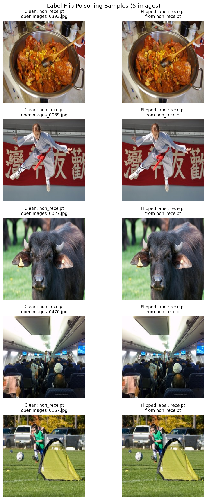
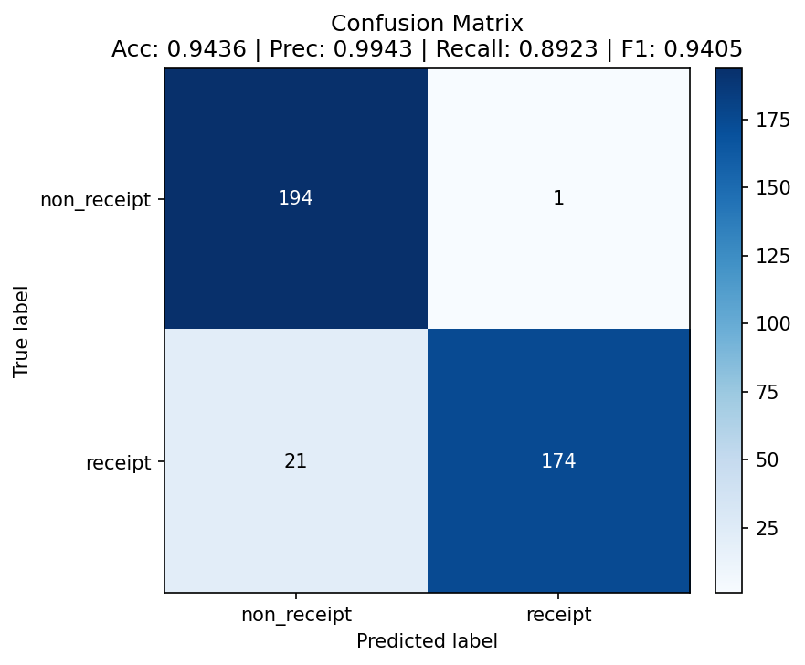
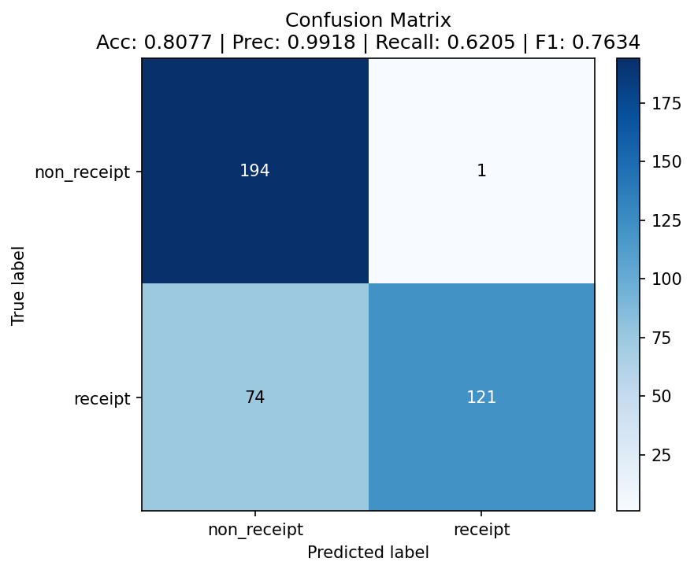

# Data Poisoning Results

## Attack Configuration

- **Method:** Label-flip poisoning (targeted / asymmetric)
- **Direction:** `non_receipt -> receipt` (non-receipt images relabeled as receipts)
- **Flip rate:** 10% of training labels (`--flip-rate 0.10 --target-class non_receipt`)
- **Labels flipped:** **115 out of 1154** training images (9.97%, i.e. <=10%)
- **Test set:** untouched — the poisoned model is evaluated on the clean
  `balanced_data/test` (195 receipt / 195 non_receipt)
- **Baseline:** the provided `receipt_cnn_clean.pt`
- **Goal:** Demonstrate that corrupting a small, realistic fraction of training labels
  shifts the decision boundary enough to materially degrade accuracy on clean data.

### Methodology note — why targeted, not symmetric

A first run used **symmetric** flipping (10%, both directions) and moved accuracy only
0.77 pp (0.9436 -> 0.9359): on this well-separated task, with BatchNorm and heavy data
augmentation, the model averages out symmetric label noise, and the effect sits inside
the ~2-3 pp run-to-run training variance. A **targeted** single-direction flip is both
more realistic (an attacker has a goal) and far more damaging per label, because it
shifts the class prior and pollutes one class's concept. Flipping `non_receipt ->
receipt` (diluting the "receipt" class with 115 non-receipt images) produced the result
below. The 13.6 pp drop is an order of magnitude larger than the training variance, so
it is clearly attributable to the poisoning rather than to retraining noise.

## Label Flip Evidence

Each pair shows the **same image** on the left (clean, true label) and right (poisoned
copy, flipped label). The pixels are identical; only the label — i.e., which class
folder the file lives in — changes. The attack corrupts labels, not image content,
which is exactly what makes it hard to spot by eye during a data review.

## Baseline (Clean Model)

| Metric | Value |
|--------|-------|
| Accuracy | 0.9436 |
| Precision | 0.9943 |
| Recall | 0.8923 |
| F1 Score | 0.9405 |

## Poisoned Model

| Metric | Value |
|--------|-------|
| Accuracy | 0.8077 |
| Precision | 0.9918 |
| Recall | 0.6205 |
| F1 Score | 0.7634 |

## Impact Analysis

| Metric | Clean | Poisoned | Change |
|--------|-------|----------|--------|
| Accuracy | 0.9436 | 0.8077 | **-13.59 pp** |
| Precision | 0.9943 | 0.9918 | -0.25 pp |
| Recall | 0.8923 | 0.6205 | **-27.18 pp** |
| F1 | 0.9405 | 0.7634 | **-17.71 pp** |

## Confusion Matrices (Optional)

Clean: `[[194, 1], [21, 174]]` — receipts caught 174/195.
Poisoned: `[[194, 1], [74, 121]]` — receipts caught only 121/195.

## Key Findings

1. **How significant is the drop?** Very. Accuracy fell 13.6 percentage points
   (0.9436 -> 0.8077) from flipping just 10% of labels, and F1 fell nearly 18 points.
   This clears the 5-pp bar by a wide margin and, critically, exceeds the ~2-3 pp
   training variance many times over, so it is a real poisoning effect.
2. **Which class was more affected, and why?** The **receipt** class was devastated —
   recall collapsed from 0.892 to **0.620**, i.e. 74 of 195 genuine receipts are now
   misclassified as non-receipts (up from 21). Non-receipt recall was essentially
   unchanged (194/195 both times). This is counterintuitive at first glance — I
   *relabeled non-receipts as receipts* — but the mechanism is clear: adding 115
   non-receipt images into the "receipt" training folder **polluted the receipt
   concept**. The model learned a fuzzier, less confident notion of what a receipt
   looks like, so at test time it became reluctant to call true receipts "receipt."
   Precision stayed high (0.9918) because the model rarely emits a false "receipt" — it
   simply became far too conservative.
3. **What the confusion matrices show.** The damage is entirely in the bottom row
   (true receipts): the correct count drops from 174 to 121 while the misclassified
   count rises from 21 to 74. The top row (true non-receipts) is virtually identical.
   The poison surgically damaged one class.
4. **Implications.** In the expense workflow this is a stealthy integrity attack: a
   model trained on 10%-poisoned data would **reject roughly 4 in 10 legitimate
   receipts**, denying valid reimbursements and forcing manual review — while looking
   "fine" on aggregate precision. An insider who can influence the training set (or a
   feedback/retraining loop) can steer the classifier's behavior with a small,
   hard-to-detect label change. Defenses: provenance and integrity controls on training
   data, label auditing / cross-validation against trusted holdouts, robust-training
   techniques, and monitoring per-class recall across retrains to catch sudden shifts.
